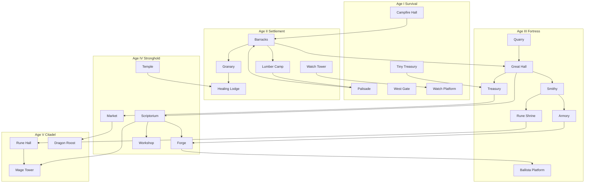

# Northern Shield — Building Dependency Tree

*Every structure unlocks systems — nothing stands alone*

Buildings are the **spine** of progression. Players discover features by **erecting**, not by hitting level 12. See [unlock_philosophy.md](unlock_philosophy.md) and [building_dependency_tree.md](building_dependency_tree.md) companion [buildings.md](buildings.md).

**Legend:** `→` unlocks · `⇄` mutual synergy · `(Age)` first appearance

---

## Dependency overview

---

## Age I — Survival buildings

### Campfire Hall

| | |
|--|--|
| **Purpose** | Roster identity; cap 3; naming ceremony |
| **Requirements** | Default at campaign start |
| **Unlocks** | War Camp, recruit slot 2–3, first chronicle |
| **Dependencies** | None |
| **Upgrades** | I → Longhouse (Age II) → Great Hall chain |
| **Interactions** | Feeds Heroes domain; gates Barracks |

### Palisade

| | |
|--|--|
| **Purpose** | Only defense; teaches breach fear |
| **Requirements** | Campfire Hall |
| **Unlocks** | Gate posts, repair loop (gold) |
| **Dependencies** | Wood (Age II) for repair |
| **Upgrades** | Reinforced → Stone Curtain (Age III) |
| **Interactions** | Palisade damage → Chronicle; Lumber Camp repair discount |

### West Gate (timber)

| | |
|--|--|
| **Purpose** | Single defensive post; Age I skill check |
| **Requirements** | Palisade ring |
| **Unlocks** | Fortress Prep assignment verb |
| **Dependencies** | Hero assigned |
| **Upgrades** | Iron-bound → Rune ward (Age V) |
| **Interactions** | Watch Platform intel on gate facing |

### Watch Platform

| | |
|--|--|
| **Purpose** | Assault intel stub (+1 wave preview) |
| **Requirements** | Palisade |
| **Unlocks** | Scout role value; upgrade path to Watch Tower |
| **Dependencies** | None |
| **Upgrades** | → Watch Tower (Age II) |
| **Interactions** | Stacks with Scout hero; feeds Preparation intel |

### Tiny Treasury

| | |
|--|--|
| **Purpose** | Gold reserve cap; teaches saving |
| **Requirements** | First victory |
| **Unlocks** | Gold reserve UI; march supplies fantasy |
| **Dependencies** | Battle gold |
| **Upgrades** | Treasury I–III (cap + passive income) |
| **Interactions** | Quartermaster role; raid protection at Tier III |

---

## Age II — Settlement buildings

### Barracks

| | |
|--|--|
| **Purpose** | Recruit cadence; housing |
| **Requirements** | Campfire Hall → Longhouse, Palisade intact |
| **Unlocks** | Recruit tab rhythm; starter gold bonus (with Treasury) |
| **Dependencies** | Food from Granary |
| **Upgrades** | II expands cadence; III veteran recruit chance |
| **Interactions** | ⇒ Granary, Great Hall, Market recruits |

### Granary

| | |
|--|--|
| **Purpose** | Food storage; roster upkeep |
| **Requirements** | Barracks I, Lumber Camp |
| **Unlocks** | **Food** resource; upkeep per assault |
| **Dependencies** | Wood build cost |
| **Upgrades** | Cap + silo; famine resistance event |
| **Interactions** | Healing Lodge recovery speed; Dragon Roost upkeep (future) |

### Lumber Camp

| | |
|--|--|
| **Purpose** | Wood income |
| **Requirements** | Barracks I |
| **Unlocks** | **Wood** resource; palisade repair |
| **Dependencies** | Food workers (1) |
| **Upgrades** | II passive trickle between assaults |
| **Interactions** | Palisade, Granary construction, Workshop |

### Healing Lodge

| | |
|--|--|
| **Purpose** | Injury recovery; morale |
| **Requirements** | Granary I, first hero injury event |
| **Unlocks** | Between-assault heal timers; Healer path hint |
| **Dependencies** | Food upkeep |
| **Upgrades** | II −25% injury time; III prevent scar (once/campaign) |
| **Interactions** | Temple (Age IV); Valkyrie legend tree |

### Watch Tower

| | |
|--|--|
| **Purpose** | Scout post; intel depth |
| **Requirements** | Watch Platform, stone footings (Age II boss) |
| **Unlocks** | Watch Tower **post** on schematic; +event preview |
| **Dependencies** | Scout role |
| **Upgrades** | Range intel on command map |
| **Interactions** | Military/Blondie; Scriptorium “scrying” research |

---

## Age III — Fortress buildings

### Great Hall

| | |
|--|--|
| **Purpose** | Heart of roster; promotions; saga |
| **Requirements** | Barracks II, Stone Curtain, Quarry blueprint |
| **Unlocks** | Cap 8–10; **Veteran** promotions; chronicle hall |
| **Dependencies** | Stone, gold |
| **Upgrades** | I → II (Captain) → III (Jarl council) |
| **Interactions** | ⇒ Treasury, Smithy, Scriptorium, Mage Tower; every hero legend rank |

### Treasury

| | |
|--|--|
| **Purpose** | Reserve cap; passive gold; raid shield |
| **Requirements** | Tiny Treasury, Great Hall I |
| **Unlocks** | Between-assault income; gold **not** spent on field only |
| **Dependencies** | Battle victories |
| **Upgrades** | Cap +5g/assault + plunder reduction |
| **Interactions** | Market, Quartermaster, Hydda |

### Smithy

| | |
|--|--|
| **Purpose** | Crafting entry; iron sink |
| **Requirements** | Great Hall I, first iron bundle |
| **Unlocks** | **Crafting** tier 1; gate fixtures |
| **Dependencies** | Iron |
| **Upgrades** | → Forge (Age IV) |
| **Interactions** | Armory, Ballista Platform, Engineering |

### Quarry (meta)

| | |
|--|--|
| **Purpose** | Stone trickle |
| **Requirements** | Region boss stone; Lumber Camp II |
| **Unlocks** | Stone income; wall tier projects |
| **Dependencies** | Food workers |
| **Upgrades** | Mine branch (iron) |
| **Interactions** | Great Hall, wall repair, outer bailey |

### Armory

| | |
|--|--|
| **Purpose** | Equipment system |
| **Requirements** | Smithy I, Great Hall I |
| **Unlocks** | Weapon/armor slots; boss loot equip |
| **Dependencies** | Iron, gold |
| **Upgrades** | Named gear racks; relic slot |
| **Interactions** | Forge, heroes, chronicle legendary entries |

### Rune Shrine (field post)

| | |
|--|--|
| **Purpose** | Star → rune bridge on field |
| **Requirements** | Great Hall II, first boss star haul |
| **Unlocks** | **Runes** on heroes; Rune Keeper role value |
| **Dependencies** | Stars (battle performance) |
| **Upgrades** | → Rune Hall (meta, Age V) |
| **Interactions** | Rune Forge; Mage Tower |

### Ballista Platform

| | |
|--|--|
| **Purpose** | Siege post — anti-swarm |
| **Requirements** | Smithy I, Fortress Prep siege slot |
| **Unlocks** | Structure assignment on schematic |
| **Dependencies** | Iron, gold field budget |
| **Upgrades** | Rune bolts (Rune Hall); Engineer upgrades |
| **Interactions** | Catapult Platform; Workshop traps |

### Catapult Platform

| | |
|--|--|
| **Purpose** | Siege post — anti-armor |
| **Requirements** | Ballista Platform placed once, iron |
| **Unlocks** | Armor break synergy with Military |
| **Dependencies** | Workshop (Age IV) for tier II |
| **Upgrades** | Fire pot ammo (crafting) |
| **Interactions** | Siege Specialist legend path |

---

## Age IV — Stronghold buildings

### Market

| | |
|--|--|
| **Purpose** | Trade; reputation sinks |
| **Requirements** | Treasury II, Reputation ≥ 1 |
| **Unlocks** | **Reputation** spending; wood⇄iron trade |
| **Dependencies** | Great Hall II |
| **Upgrades** | Caravan events; ally shop |
| **Interactions** | Embassy, Granary, diplomacy |

### Scriptorium

| | |
|--|--|
| **Purpose** | Research; ancient knowledge |
| **Requirements** | Great Hall II, boss lore drop |
| **Unlocks** | **Research** tree; knowledge income |
| **Dependencies** | Reputation |
| **Upgrades** | III unlocks mythic branch |
| **Interactions** | ⇒ Forge, Workshop, Mage Tower, Rune Hall |

### Forge

| | |
|--|--|
| **Purpose** | Armor tier 2; military crafting |
| **Requirements** | Smithy II, Scriptorium I |
| **Unlocks** | Named weapons; siege ammo |
| **Dependencies** | Iron, knowledge |
| **Upgrades** | Legendary forge (Age VI) |
| **Interactions** | Armory, Ballista, Engineer |

### Temple / Ancestor Hall

| | |
|--|--|
| **Purpose** | Faith; morale; geas foundation |
| **Requirements** | Healing Lodge II, memorial event |
| **Unlocks** | **Faith** stub; morale recovery; geas opt-in |
| **Dependencies** | Food, reputation |
| **Upgrades** | II hero spell blessing |
| **Interactions** | Healing Lodge, Mage Tower, chronicle |

### Workshop

| | |
|--|--|
| **Purpose** | Engineering — traps, gate gears |
| **Requirements** | Smithy I, Scriptorium I |
| **Unlocks** | **Engineering**; trap slots on walls |
| **Dependencies** | Wood, iron |
| **Upgrades** | Spring nets, oil pour |
| **Interactions** | Engineer hero; Catapult; gate repair discount |

---

## Age V — Citadel buildings

### Rune Hall

| | |
|--|--|
| **Purpose** | Fortress-scale magic; rune walls |
| **Requirements** | Rune Shrine max, Scriptorium II, mythic omen |
| **Unlocks** | **Fortress spells**; wall rune veins |
| **Dependencies** | Ancient knowledge, stars |
| **Upgrades** | III global rune discount |
| **Interactions** | Mage Tower, Dragon Roost, gate upgrades |

### Mage Tower

| | |
|--|--|
| **Purpose** | Hero spells; knowledge spend |
| **Requirements** | Rune Hall I, Captain-ranked hero |
| **Unlocks** | **Hero spells** at Jarl |
| **Dependencies** | Knowledge, Great Hall III |
| **Upgrades** | Second spell slot (one hero) |
| **Interactions** | Blondie/Mage path; fortress spell combo |

### Dragon Roost

| | |
|--|--|
| **Purpose** | Dragon defense; sky lane |
| **Requirements** | Market III, Reputation peak, boss dragon omen |
| **Unlocks** | **Dragon Rider** path; sky assault defense |
| **Dependencies** | Food + reputation upkeep |
| **Upgrades** | Bond depth (1 dragon, not collector) |
| **Interactions** | Ballista sky lane; Glory resource |

---

## Field vs meta matrix

| Building | Field post | War Camp meta |
|----------|------------|---------------|
| West Gate | ✓ | — |
| Watch Tower | ✓ | upgrade node |
| Ballista Platform | ✓ | — |
| Healing Lodge | — | ✓ |
| Great Hall | visual on goal | ✓ |
| Treasury | — | ✓ |
| Rune Shrine | ✓ | Rune Hall meta |
| Dragon Roost | sky icon | ✓ |

---

## Anti-patterns

- Building that only +5% HP with no unlock
- Duplicate “barracks” under another name
- Age V building available in Age II because “player grinded”
- Siege platform without Smithy — breaks dependency fantasy

---

## See also

- [progression_tree.md](progression_tree.md)
- [economy_flow.md](economy_flow.md)
- [system_dependency_map.md](system_dependency_map.md)
