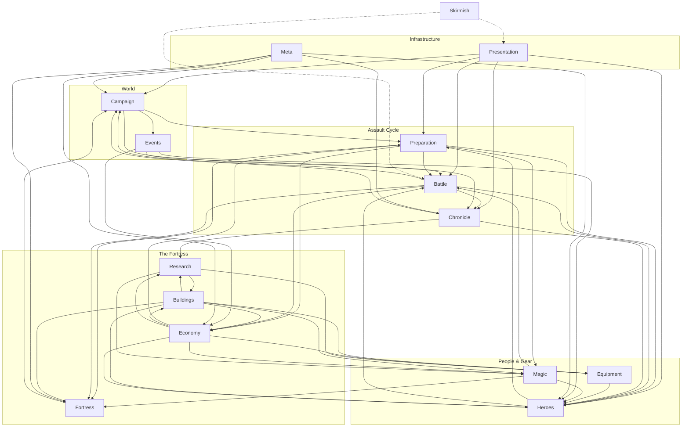
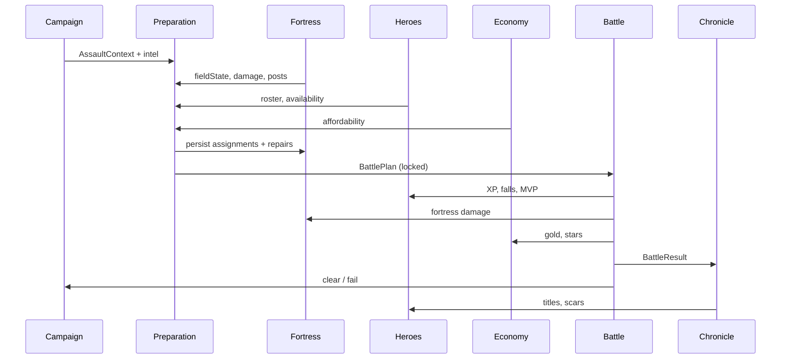

# Northern Shield — Domain Architecture

*Lead architecture reference · Foundation Phase · permanent*

This document defines **independent game domains**, their responsibilities, boundaries, and dependencies. It is derived from the [design foundation](README.md) and maps to the current prototype without prescribing new gameplay.

**Rules for implementers:**

1. Domains communicate through **defined inputs/outputs**, not shared mutable globals.
2. **Battle** never recruits; **Heroes** never pathfind; **Economy** never spawns enemies.
3. **Preparation** orchestrates domains before combat; **Presentation** orchestrates screens — neither owns game rules.
4. When in doubt, check [north_star.md](north_star.md).

---

## Architecture overview

Northern Shield is organized as a **fortress saga engine**: persistent home state, episodic assaults, combat as verdict, chronicle as memory.

```
┌─────────────────────────────────────────────────────────────────────────┐
│                        PRESENTATION (screens / phases)                   │
│   slotSelect · campaignSelect · nodeMap · betweenBattles · fortressPrep  │
│   · playing · debrief                                                    │
└─────────────────────────────────────────────────────────────────────────┘
                                      │
                    ┌─────────────────┼─────────────────┐
                    ▼                 ▼                 ▼
            ┌──────────────┐  ┌──────────────┐  ┌──────────────┐
            │  CAMPAIGN    │  │ PREPARATION  │  │   BATTLE     │
            │  (where/when)│  │ (plan)       │  │  (verdict)   │
            └──────────────┘  └──────────────┘  └──────────────┘
                    │                 │                 │
        ┌───────────┼───────────┐     │     ┌───────────┼───────────┐
        ▼           ▼           ▼     ▼     ▼           ▼           ▼
   ┌─────────┐ ┌─────────┐ ┌─────────┐ ... ┌─────────┐ ┌─────────┐
   │FORTRESS │ │ HEROES  │ │ ECONOMY │     │CHRONICLE│ │ MAGIC   │
   │         │ │         │ │         │     │         │ │(future) │
   └─────────┘ └─────────┘ └─────────┘     └─────────┘ └─────────┘
        │           │           │
        └───────────┴───────────┴── BUILDINGS · EQUIPMENT · RESEARCH
                                      │
                              ┌───────┴───────┐
                              │     META      │
                              │ (persistence) │
                              └───────────────┘
```

---

## Domain index

| Domain | One-line purpose |
|--------|------------------|
| [Campaign](#campaign) | Where the war is and which assault comes next |
| [Fortress](#fortress) | The home — tier, posts, walls, gates, damage |
| [Heroes](#heroes) | People — roster, legend growth, attachment |
| [Preparation](#preparation) | Turn plans into a locked battle loadout |
| [Battle](#battle) | Execute assault; produce combat facts |
| [Economy](#economy) | Resources, costs, income, caps |
| [Buildings](#buildings) | Structures that unlock systems and production |
| [Equipment](#equipment) | Weapons, armor, amulets, gear slots |
| [Magic](#magic) | Runes, hero spells, fortress spells |
| [Research](#research) | Technology tree and civilization unlocks |
| [Chronicle](#chronicle) | Memory — history, fallen, legends, stats |
| [Events](#events) | Scripted beats between assaults |
| [Meta](#meta) | Save slots, session, migration |
| [Presentation](#presentation) | Game phases and screen orchestration |
| [Skirmish](#skirmish) | Secondary TD mode (isolated ruleset) |

---

## Campaign

### Purpose

Own **world progression**: regions, command map, fronts, assault generation, pacing, and difficulty curve. Answers *where is the war* and *which fight is next*.

### Responsibilities

- 100-region campaign structure and unlock rules
- Four-front command map layout per region
- Assault codenames, tiers, wave plans per node
- Boss placement and region completion
- Tutorial / pacing hooks (march supplies, softer early curve)
- Assault intel package for Preparation (composition preview, front, tier)
- Skirmish entry point (handoff to isolated mode)

### Inputs

| From | Data |
|------|------|
| Meta | `campaignProgress`, slot index, session resume pointer |
| Fortress | Region `fieldState` summary for command map display |
| Chronicle | Optional flags (boss defeated, saga milestones) |

### Outputs

| To | Data |
|----|------|
| Preparation | `AssaultContext` — mapIndex, nodeIndex, frontId, wavePlan, intel |
| Battle | `NodeWavePlan`, portal count, boss config, difficulty tier |
| Economy | Victory bundles (resources — when implemented), star awards |
| Chronicle | Region clear events, assault metadata |
| Presentation | `nodeMap` state, front unlock lines, next assault hints |

### Dependencies

- **Meta** — progress persistence
- **Fortress** — per-map `fieldState` anchor
- Does **not** depend on Battle runtime or grid simulation

### Future expansion

- World map epilogue states per cleared region
- Non-combat command nodes (trade, diplomacy)
- Dynamic front pressure (neglected front escalates)
- Seasonal / realm events tied to map index

### Prototype mapping

`src/campaign/campaignMaps.js`, `campaignFronts.js`, `campaignRun.js`, `onboarding.js`, `campaignDeploy.js`

---

## Fortress

### Purpose

The **fortress is the main character**. Own physical and narrative state of the stronghold: tier, defensive layout, wall/gate integrity, posts, and visual identity.

### Responsibilities

- Fortress **tier** (Village → Last Bastion) and visual tier hooks
- **Defensive posts** — assignment model, validation, grid projection
- Per-map **field state** — gold on field, towers snapshot, walls, `postAssignments`
- **Walls and gates** — ring geometry, HP, facing damage, breach semantics
- **Fortress rating** — composite “strength of home” for advisor / UI (design)
- Meta **fortress upgrades** aggregation (bonuses from Buildings domain)
- Schematic representation for Fortress Prep (not maze building in campaign)
- Deploy snapshot / fallen-hero merge between assaults

### Inputs

| From | Data |
|------|------|
| Preparation | Post assignments, repair orders, siege choices |
| Battle | `FortressDamageReport` — gate HP delta, wall segments hit, breaches |
| Economy | Repair costs, material availability |
| Buildings | Unlocked tier caps, passive bonuses |
| Research | Rune wall rules, spell slot count (future) |

### Outputs

| To | Data |
|----|------|
| Preparation | Current posts, damage state, repair options, tier visuals |
| Battle | `FieldLayout` — towers[], walls{}, spawn/goal context |
| Campaign | `fieldState` persistence per map |
| Chronicle | Breach history, gate names, fortress scars |
| Presentation | Schematic markers, War Camp fortress backdrop tier |

### Dependencies

- **Buildings** — upgrade definitions and bonuses
- **Heroes** — defender IDs in assignments (reference only)
- **Economy** — pay for repairs and siege
- Does **not** own hero XP, enemy AI, or assault generation

### Future expansion

- Living city **districts** (visual clusters)
- Fortress spells anchored to wall faces
- Dragon perch / sky lane defense
- Unique capstone silhouette per campaign path
- Named wall segments in saga

### Prototype mapping

`src/fortress/defensivePosts.js`, `fortress.js`, `campaignRun.js` (field serialization), wall/gate logic in `game.js` (target: extract)

---

## Heroes

### Purpose

Own **people** — persistent defenders, legend growth, and everything that makes Gunnar Gunnar.

### Responsibilities

- Roster collection — recruit, cap, release, deploy flags
- **Defender** identity — name, class, career XP/level
- **Promotion / legend rank** — Guard → Veteran → Captain → Jarl (design ladder)
- **Traits** — personality modifiers in and out of combat
- **Fortress roles** — gatekeeper, scout, etc.; zone fit hints
- **Talents** — milestone career unlocks
- **Injuries / morale** — between-assault condition (design)
- **Veteran status**, scars, titles, bonds, legacy succession (future)
- Warband composition analysis and advisor hints
- Combat stat projection for Battle (from career + equipment + traits + roles)

### Inputs

| From | Data |
|------|------|
| Preparation | Post assignment requests |
| Battle | Kills, damage dealt/taken, fall events, MVP signal |
| Economy | Recruit costs, food upkeep (future) |
| Buildings | Roster cap (Great Hall), barracks recruit cadence |
| Equipment | Equipped items, rune slots on gear |
| Chronicle | Title awards, scar triggers |

### Outputs

| To | Data |
|----|------|
| Preparation | Roster list, availability, role fit, injuries |
| Battle | `HeroCombatProfile[]` linked to field towers via `defenderId` |
| Chronicle | Career stats, epitaph seeds, bond events |
| Presentation | War Camp cards, dossier, rename ceremony |

### Dependencies

- **Equipment**, **Magic** (runes on hero) — modifiers only
- **Buildings** — caps and unlocks
- **Economy** — recruit and upkeep
- Does **not** own grid, waves, or assault layout

### Future expansion

- Injury recovery timers in War Camp
- Promotion titles tied to posts held (“Gate Captain”)
- Hero spells at Jarl rank
- Legacy buff on successor
- Morale chain events with food shortage

### Prototype mapping

`src/roster/` — `defender.js`, `roster.js`, `talents.js`, `heroRoles.js`, `traits` + `traitGameplay.js`, `warbandComposition.js`, `names.js`, `heroMovement.js`

---

## Preparation

### Purpose

**Orchestration domain** for Fortress Prep phase. Converts player choices into a **locked `BattlePlan`** without running combat.

### Responsibilities

- Fortress Prep phase rules — what player can change
- Post picker UX contract (assign / clear / swap heroes)
- Siege and gate fixture choices on posts
- Repair queue authoring (walls/gates) before assault
- Validate minimum readiness (≥1 hero, gate rule on tutorial)
- Call `buildTowerPlacements` — posts → field layout
- Attach assault intel (read-only) from Campaign
- Skald advisor lines from composition + roles (future)
- Produce `BattlePlan` snapshot for Battle + deploy snapshot for casualties

### Inputs

| From | Data |
|------|------|
| Campaign | `AssaultContext`, intel |
| Fortress | Damage state, post assignments, field gold |
| Heroes | Roster availability, role fit |
| Economy | Affordability of repairs / siege |
| Magic | Spell loadout (future) |

### Outputs

| To | Data |
|----|------|
| Battle | `BattlePlan` — towers[], walls{}, assignments, wave entry state |
| Fortress | Persisted `fieldState` + `postAssignments` |
| Presentation | Prep UI state, validation errors |

### Dependencies

- **Campaign**, **Fortress**, **Heroes**, **Economy** — read/write within prep rules
- **Battle** — only via `BattlePlan` handoff, not live coupling

### Future expansion

- Spell loadout panel (Citadel)
- Repair vs upgrade fork choices
- “Recommended plan” from advisor AI

### Prototype mapping

`fortressPrep` phase in `game.js`, `defensivePosts.js`, `launchFieldPrepAssault()` — target: `src/preparation/` module

---

## Battle

### Purpose

**Combat verdict engine**. Runs waves, simulates damage, resolves win/loss. Does not shop, recruit, or edit layout in campaign.

### Responsibilities

- Wave scheduler — spawn queues, auto-advance between node waves
- **Enemy AI** — pathless assault targeting, gate/structure priority
- **Hero behavior** — movement, targeting, abilities (class rules)
- **Damage pipeline** — deal, mitigate, heal, shields
- **Projectiles** — bullets, homing, on-hit effects
- **Structures** — siege firing, passive structures
- **Boss** phases and telegraphs
- Wave events / modifiers (frost wind, swarm, etc.)
- Lives, breach, gold plunder on leak
- Combat HP vs career separation; per-assault casualties
- `BattleResult` — outcome, stats, MVP, fortress damage, fallen IDs
- Skirmish ruleset variant (maze, BFS, endless)

### Inputs

| From | Data |
|------|------|
| Preparation | `BattlePlan` (locked at assault start) |
| Campaign | `NodeWavePlan`, enemy tier tables |
| Heroes | Combat profiles, trait hooks, role zone context |
| Fortress | Wall/gate HP at start |
| Equipment / Magic | Combat modifiers |
| Buildings | Passive combat bonuses |

### Outputs

| To | Data |
|----|------|
| Chronicle | `BattleResult` facts for prose generation |
| Heroes | XP, kills, fall/injury flags |
| Fortress | Gate/wall HP delta, structure loss |
| Economy | Gold earned/lost, star awards |
| Campaign | Node clear / fail, progress advance |
| Presentation | Live combat HUD, pause, speed, debrief trigger |

### Dependencies

- **Preparation** must complete before campaign assault
- **Entities** (Tower, Enemy, Bullet) are Battle **implementations**, not separate domains
- Does **not** persist campaign progress directly — emits results upward

### Future expansion

- Hero manual ability trigger (one per legend)
- Fortress spell execution from wall faces
- Replay / combat log for chronicle
- Assault modifiers from diplomacy

### Prototype mapping

`src/entities/`, `src/combat/assaultTargeting.js`, `src/grid/grid.js` (skirmish), wave logic in `game.js` (target: `src/battle/`)

---

## Economy

### Purpose

Own **all resource wallets, flows, and affordability rules**. Gold must not solve every problem.

### Responsibilities

- **Battle economy** — field gold, kill rewards, plunder
- **Campaign economy** — wood, stone, iron, food (design)
- **Kingdom progress** — reputation, ancient knowledge (design)
- **Stars (✦)** — assault performance currency (prototype)
- **Gold reserve** — treasury cap and passive income hooks
- Income schedules — buildings, events, victory bundles
- Cost validation — can afford repair, recruit, craft, research
- Storage caps — granary, treasury overflow rules (design)

### Inputs

| From | Data |
|------|------|
| Battle | Gold delta, performance tier |
| Campaign | Region difficulty, event grants |
| Buildings | Production rates, caps, discounts |
| Chronicle | Milestone payouts (optional) |

### Outputs

| To | Data |
|----|------|
| Preparation | Affordability checks |
| Heroes | Recruit cost, upkeep (future) |
| Fortress | Repair costs |
| Buildings | Purchase / upgrade costs |
| Equipment / Magic | Craft and rune costs |
| Research | Knowledge spend |
| Presentation | Wallet display per screen |

### Dependencies

- **Buildings** for production; **Campaign** for pacing
- Pure **ledger** — does not know enemy types or post geometry

### Future expansion

- Food shortage narrative events
- Trade routes (reputation ↔ materials)
- Inflation guards per fortress tier

### Prototype mapping

Gold, stars, `goldReserve` in campaign save; `getFortressBonuses()` discounts — target: `src/economy/`

---

## Buildings

### Purpose

**Structures unlock systems.** Distinguishes *what exists* from *how the fortress feels* (Fortress domain).

### Responsibilities

- Building **catalog** — field structures vs meta buildings vs districts
- Upgrade tiers I–III per building
- **Unlock registry** — which systems become available at which tier
- Production definitions — passive income, caps (with Economy)
- Cost definitions — resource types per upgrade
- Gate rules — fortress phase, reputation, assault milestones
- Bonus aggregation exported to Fortress / Heroes / Battle

### Inputs

| From | Data |
|------|------|
| Economy | Payment authorization |
| Research | Prerequisite tech nodes (future) |
| Campaign | Milestone gates |
| Fortress | Current tier ceiling |

### Outputs

| To | Data |
|----|------|
| Fortress | Unlocked posts, visual tier hooks |
| Heroes | Roster cap, recruit slots |
| Economy | Production definitions |
| Equipment | Crafting availability |
| Magic | Rune forge tiers |
| Research | Scriptorium enable |
| Presentation | War Camp fortress tab UI |

### Dependencies

- **Economy** for costs
- **Research** for tech gates (future)
- Does **not** simulate combat or assign posts

### Future expansion

- Great Hall, Rune Forge, Granary, Market, Scriptorium full trees
- Choice forks (deep walls vs deep hall)
- District unlocks at Citadel

### Prototype mapping

`src/fortress/fortress.js` `FORTRESS_DEFS` — target: split **Buildings** catalog from **Fortress** state

---

## Equipment

### Purpose

Own **gear** — weapons, armor, amulets — and how they modify heroes.

### Responsibilities

- Item definitions — rarity, slot type, stat bonuses
- Inventory — campaign equipment bag, boss drops
- Equip / unequip rules per hero
- **Rune slots on gear** (prototype item runes)
- Crafted gear integration (future, with Buildings/Research)
- Visual silhouette hooks (future)
- Named legendary items with saga lines (future)

### Inputs

| From | Data |
|------|------|
| Battle | Loot drops |
| Economy | Craft/purchase costs |
| Buildings | Armory / forge tier |
| Research | Recipe unlocks |

### Outputs

| To | Data |
|----|------|
| Heroes | Equipped loadout, bonus projection |
| Battle | Combat modifiers via hero profiles |
| Chronicle | Legendary acquisition entries |

### Dependencies

- **Heroes** — equip targets
- **Economy**, **Buildings**, **Research** — acquisition paths
- Independent of grid and waves

### Future expansion

- Weapon/armor tiers with single signature rule each
- Set bonuses tied to fortress culture
- Durability / repair (optional)

### Prototype mapping

`src/roster/items.js`, equipment inventory on campaign save

---

## Magic

### Purpose

Own **supernatural rules** — runes, hero spells, fortress spells — without becoming a generic mana bar in combat.

### Responsibilities

- **Rune definitions** — effects, costs, ownership limits
- Rune inventory and equip rules (hero / gate / wall)
- **Hero spells** — legend-rank abilities (future)
- **Fortress spells** — prep loadout, battle execution, costs (future)
- Star ↔ rune economy bridge (prototype)
- Rune wall and ritual circle rules (Citadel+)

### Inputs

| From | Data |
|------|------|
| Economy | Stars, knowledge costs |
| Buildings | Rune Forge tier |
| Heroes | Legend rank, equip slots |
| Research | Spell school unlocks |
| Preparation | Loadout choices |

### Outputs

| To | Data |
|----|------|
| Battle | Active effects, cooldowns, on-cast costs |
| Heroes | Equipped rune state |
| Fortress | Wall vein modifiers |
| Chronicle | Mythic event lines |

### Dependencies

- **Heroes**, **Fortress**, **Preparation**, **Battle**
- Should not own roster identity or assault generation

### Future expansion

- Geas costs (permanent scar for power)
- Dragon bond as magic-adjacent system
- Counter-spells on mythic bosses

### Prototype mapping

Rune defs + inventory in `game.js`; target: `src/magic/`

---

## Research

### Purpose

Own **civilization progression** — technology tree, ancient knowledge, system unlocks over long horizons.

### Responsibilities

- Research node graph — few fat nodes, not 200 +1%s
- **Ancient knowledge** spend and earn rules
- Prerequisite chains to Buildings, Magic, Equipment, Diplomacy
- Visibility rules — what jarl can see ahead
- Completion events for Chronicle

### Inputs

| From | Data |
|------|------|
| Economy | Ancient knowledge balance |
| Buildings | Scriptorium tier |
| Campaign | Boss milestones, region clears |
| Chronicle | Saga gates |

### Outputs

| To | Data |
|----|------|
| Buildings | Unlock flags |
| Magic | Spell schools |
| Equipment | Recipes |
| Events | New event types |
| Presentation | Research UI (War Camp) |

### Dependencies

- **Economy**, **Buildings**
- Does not run battles or assign posts

### Future expansion

- Cultural branches (seafarer vs rune-wright)
- Lost knowledge from fallen scholars (chronicle tie)

### Prototype mapping

Not implemented — design only

---

## Chronicle

### Purpose

**Memory of the fortress** — turn facts into saga. Every battle should tell a story.

### Responsibilities

- Battle history log — assault outcomes, MVPs, casualties
- **Fallen heroes** — hall of honored, epitaphs
- **Legendary events** — titles, scars, boss kills
- Statistics aggregation — per hero, per region, per campaign
- Prose generation — battle reports, bio, bond names
- Debrief **narrative seed** from `BattleResult`
- Saga export / book at campaign end (future)
- Achievement intersection (optional)

### Inputs

| From | Data |
|------|------|
| Battle | `BattleResult` |
| Heroes | Identity, ranks, relationships |
| Fortress | Breach history, gate names |
| Campaign | Assault metadata, region names |
| Events | Choice outcomes |

### Outputs

| To | Data |
|----|------|
| Presentation | After action prose, War Camp chronicle tab |
| Heroes | Titles, scars, trait moments |
| Campaign | Milestone flags |
| Research | Knowledge awards (future) |

### Dependencies

- Read-mostly after battle — does not alter combat mid-fight
- **No dependency** on grid or Economy ledgers

### Future expansion

- Player-editable saga highlights
- Memorial avenue sync with fallen list
- Chronicle-driven diplomacy reputation

### Prototype mapping

`src/chronicle/chronicle.js`, debrief hooks in `game.js`

---

## Events

### Purpose

Own **scripted between-assault beats** — caravans, omens, choices — that are not full battles.

### Responsibilities

- Event catalog and triggers (battles completed, region, roster state)
- Choice presentation and outcomes
- Grants/consumes resources via Economy
- Chronicle entries for decisions
- Diplomacy hooks (future)

### Inputs

| From | Data |
|------|------|
| Campaign | Progress counters |
| Heroes | Roster composition |
| Economy | Wallets |
| Fortress | Tier, damage state |

### Outputs

| To | Data |
|----|------|
| Economy | Resource deltas |
| Heroes | Recruit offers, injuries, morale |
| Chronicle | Event prose |
| Presentation | Modal / event screen |

### Dependencies

- Orchestrates **across** domains via defined effects — not a god object

### Future expansion

- Trade caravan on command map
- Food shortage chain
- Ally reinforcement choice before boss

### Prototype mapping

`src/campaign/events.js`

---

## Meta

### Purpose

**Persistence and identity** of a campaign slot — what survives between sessions.

### Responsibilities

- 10 save slots — create, delete, metadata
- Campaign save schema — version, migration
- Session resume blobs — phase, map, node (partial)
- Legacy save migration
- Campaign ID, last played, slot summary for UI
- Leaderboard / achievements (skirmish-adjacent)

### Inputs

| From | Data |
|------|------|
| All domains | Serializable snapshots on checkpoint |

### Outputs

| To | Data |
|----|------|
| All domains | Hydrated state on load |
| Presentation | Slot select UI |

### Dependencies

- **Infrastructure only** — no game rules

### Prototype mapping

`src/campaign/save.js`, `saveSlots.js`, `sessionSave.js`

---

## Presentation

### Purpose

**Screen orchestration** — game phases, input routing, HUD composition. Enforces [screen laws](FORTRESS_COMMANDER.md).

### Responsibilities

- `gamePhase` state machine
- Per-phase layout — what panels exist
- Input demux — clicks/keys to active domain actions
- Meta top bar, navigation tabs
- Onboarding hints (when to show, not business rules)
- Audio/UI juice triggers (delegate to core)
- **Does not own** combat math, roster XP, or assault generation

### Inputs

| From | Data |
|------|------|
| All domains | View models for display |
| Player | Input events |

### Outputs

| To | Data |
|----|------|
| Preparation / etc. | User intents (assign post, launch assault) |
| Renderer | Draw lists |

### Dependencies

- Reads from domains; writes only via domain APIs

### Prototype mapping

`src/core/game.js` (monolith — target: thin shell + phase routers)

---

## Skirmish

### Purpose

**Isolated secondary mode** — classic maze TD for nostalgia and balance lab. Must not infect campaign rules.

### Responsibilities

- Preset maps, BFS pathing, 100-wave curve
- Endless mode, leaderboard
- Between-wave deploy and wall building
- Separate persistence from campaign slots

### Inputs

| From | Data |
|------|------|
| Battle | Shared entity sim where convenient |
| Presentation | `mapSelect` phase |

### Outputs

| To | Data |
|----|------|
| Meta | High scores, map bests |

### Dependencies

- **Minimal** coupling to Campaign, Fortress tier, Chronicle

### Prototype mapping

`PRESET_MAPS`, pathing in `grid.js`, skirmish branch in `game.js`

---

## Dependency diagram

### Domain dependency graph (data flow)

*Arrows read as “depends on” / “consumes outputs from”.*



### Assault cycle (sequence)



---

## Coupling rules

| Allowed | Forbidden |
|---------|-----------|
| Battle reads `BattlePlan` snapshot | Battle mutates roster recruit pool |
| Preparation writes `fieldState` via Fortress API | Heroes module spawns enemies |
| Chronicle reads `BattleResult` | Chronicle changes gate HP |
| Economy validates spend; Fortress applies repair | Economy picks post assignments |
| Buildings export bonuses; Fortress aggregates | Buildings run wave scheduler |
| Presentation calls domain commands | Presentation embeds damage formulas |

---

## Prototype → target module map

| Domain | Today | Target |
|--------|-------|--------|
| Campaign | `src/campaign/*` | Keep; split deploy hints |
| Fortress | `fortress/*`, field in `campaignRun` | Expand; extract walls from `game.js` |
| Heroes | `src/roster/*` | Keep |
| Preparation | `defensivePosts` + `game.js` prep | `src/preparation/` |
| Battle | `entities/*`, `combat/*`, `game.js` | `src/battle/` |
| Economy | scattered in `game.js`, save | `src/economy/` |
| Buildings | `fortress.js` | `src/buildings/` |
| Equipment | `items.js` | `src/equipment/` |
| Magic | runes in `game.js` | `src/magic/` |
| Research | — | `src/research/` |
| Chronicle | `chronicle/*` | Keep |
| Events | `events.js` | `src/events/` |
| Meta | `save*.js` | Keep |
| Presentation | `game.js` UI | Thin shell over domains |
| Skirmish | branch in `game.js` | `src/skirmish/` |

`game.js` remains orchestrator during migration; **new rules go in domain modules**, not deeper into the monolith.

---

## Glossary

| Term | Domain | Meaning |
|------|--------|---------|
| `AssaultContext` | Campaign | Which node, front, waves, intel |
| `BattlePlan` | Preparation | Locked layout + assignments for one assault |
| `BattleResult` | Battle | Outcome facts for chronicle and progression |
| `fieldState` | Fortress | Per-map persistent layout between assaults |
| `postAssignments` | Fortress | Player-facing defensive post map |
| `FortressDamageReport` | Battle → Fortress | Gate/wall HP changes |
| `defenderId` | Heroes | Stable key linking roster to field tower |

---

## See also

- [north_star.md](north_star.md) — feature gate
- [game_loop.md](game_loop.md) — player-facing loops
- [future_systems.md](future_systems.md) — planned cross-domain features
- [tower-defense/ARCHITECTURE.md](../tower-defense/ARCHITECTURE.md) — code state review
