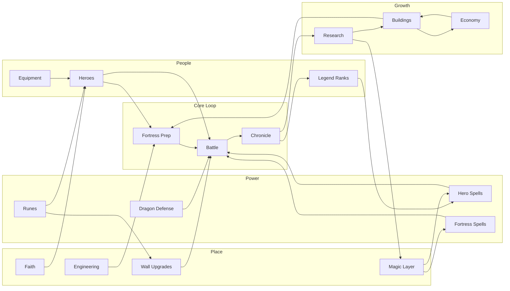
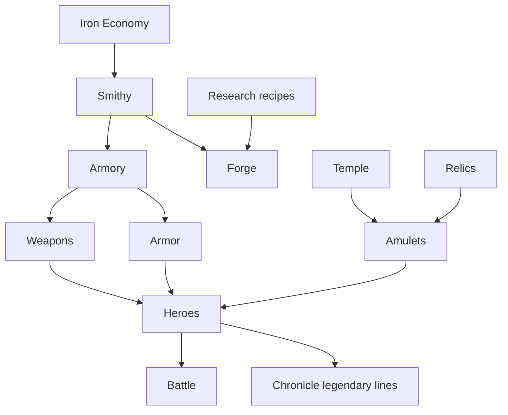
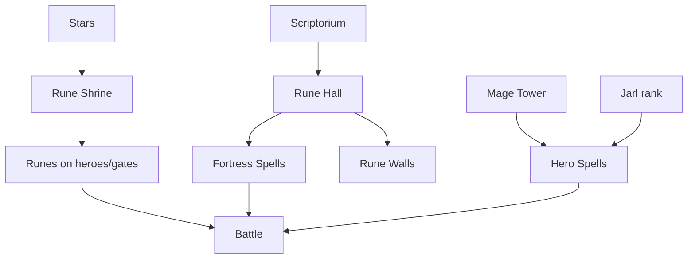
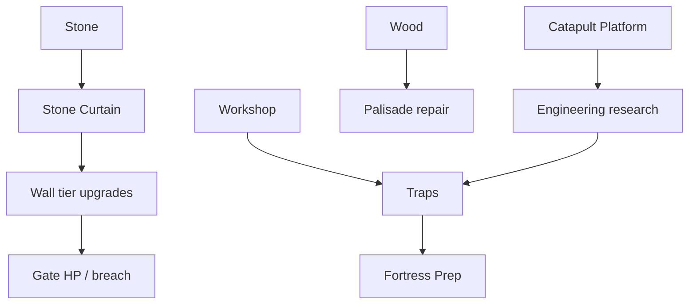
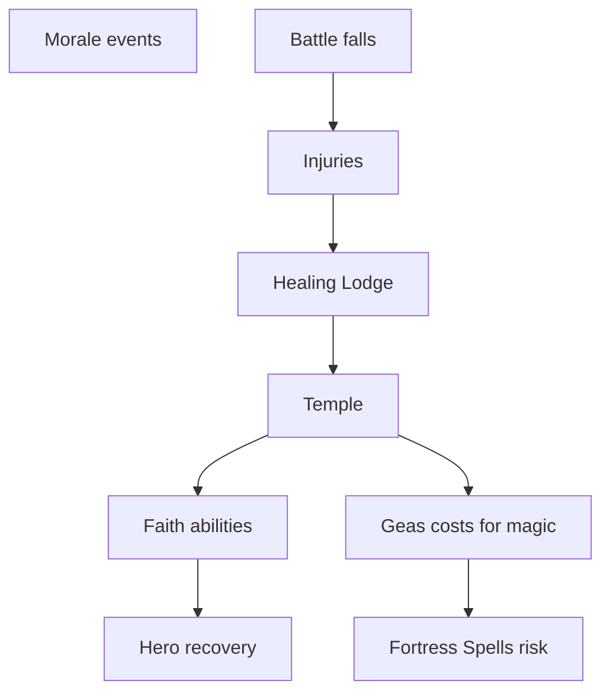
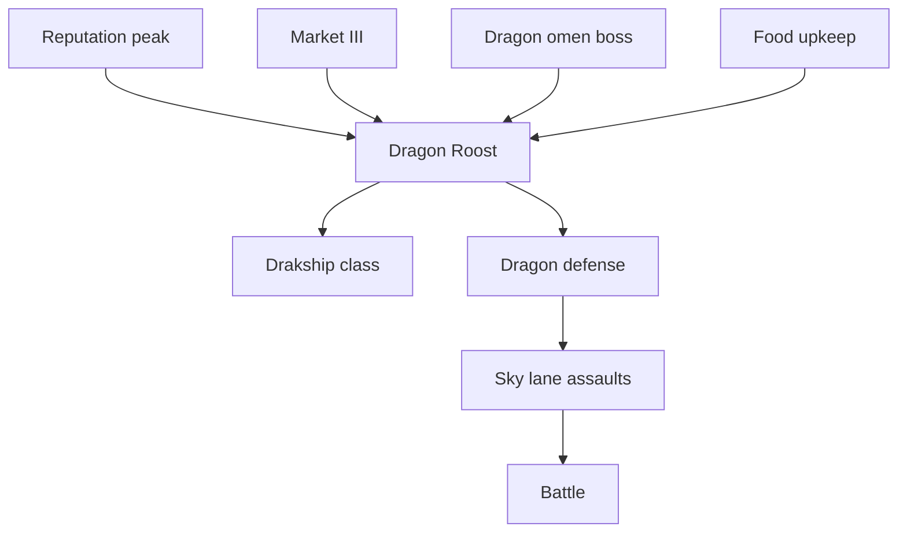

# Northern Shield — System Dependency Map

*Every system reinforces another — no orphans*

When a system appears, what unlocks it, what it needs, and what it strengthens. Timelines reference [progression_tree.md](progression_tree.md) Ages.

---

## Master reinforcement graph

---

## System reference table

| System | Appears (Age) | Unlocked by | Depends on | Strengthens |
|--------|---------------|-------------|------------|-------------|
| **Defensive posts** | II | Watch Tower + multi-gate | Heroes roster, Fortress tier | Prep, Battle readability |
| **Fortress roles** | II | Barracks II | Hero assignment | Prep advisor, Battle zones |
| **Traits** | II | Recruit / naming | Heroes | Chronicle, Battle hooks |
| **Wood economy** | II | Lumber Camp | Barracks | Palisade, Workshop |
| **Food economy** | II | Granary | Lumber Camp | Roster, Dragon upkeep |
| **Stone economy** | III | Quarry + boss | Workers, food | Walls, Great Hall |
| **Iron economy** | III | Mine + region | Quarry | Smithy, siege |
| **Great Hall promotions** | III | Stone Curtain | Stone, gold | Legend ranks, caps |
| **Chronicle titles** | III | Great Hall I | Battle results | Glory, Research gates |
| **Runes** | III | Rune Shrine + stars | Boss stars, Hall II | Heroes, gates |
| **Crafting** | III–IV | Smithy → Forge | Iron, Armory | Equipment, siege |
| **Equipment** | III | Armory | Crafting, bosses | Heroes, Battle |
| **Weapons** | III | Armory I | Iron | Hero identity, Engineer |
| **Armor** | IV | Forge I | Iron, knowledge | Tank path, injuries |
| **Amulets** | IV | Temple + Market | Reputation, relics | Support, Mage |
| **Research** | IV | Scriptorium | Knowledge, Hall II | All Age V systems |
| **Reputation** | II–IV | Boss, events | Chronicle | Market, Dragon, diplomacy |
| **Ancient Knowledge** | IV | Scriptorium | Boss lore | Research, Rune Hall |
| **Engineering** | IV | Workshop | Smithy, research | Walls, catapult, traps |
| **Wall upgrades** | II–V | Stone → rune walls | Stone, knowledge | Fortress survival, visuals |
| **Faith** | IV | Temple | Healing Lodge, memorial | Morale, geas, heals |
| **Hero Spells** | V | Mage Tower + Jarl | Knowledge, legend rank | Battle clutch, saga |
| **Fortress Spells** | V | Rune Hall | Knowledge, rune walls | Prep depth, Battle awe |
| **Magic layer** | V | Rune Hall + Tower | Research myth branch | Runes, spells, walls |
| **Dragon defense** | V | Dragon Roost | Reputation, boss | Sky lane, Rider class |
| **Diplomacy** | IV | Market II | Reputation | Events, assault relief |
| **Injuries** | IV | Healing Lodge | Battle falls | Prep choices, Faith |
| **Legacy succession** | VI | High King fall | Chronicle | Heroes, Glory |
| **Glory** | V–VI | Saga milestones | Chronicle | Cosmetics, boosts |
| **Relics** | IV+ | Boss, discovery | Reputation | Equipment, fortress |

---

## Equipment cluster

**When:** Weapons Age III; Armor Age IV; Amulets Age IV; Relics boss-gated.

---

## Magic cluster

**When:** Runes Age III; Fortress spells Age V; Hero spells Age V.

**Depends on:** Knowledge myth branch; never before Citadel emotional beat.

---

## Engineering & walls cluster

**Strengthens:** Siege Specialist heroes; Preparation; reduces gold-only repair fantasy.

---

## Faith cluster

**When:** Lodge Age II; Temple Age IV; geas pairs with Age V magic sacrifice.

---

## Dragon cluster

**Strengthens:** Age V awe; Glory; chronicle myth chapters.

**Not:** pet collection; parallel to heroes not replacement.

---

## Crafting cluster

| Input | Process | Output strengthens |
|-------|---------|-------------------|
| Iron + wood | Smithy I | Gate fixtures, basic arms |
| Iron + knowledge | Forge II | Named weapons, armor tiers |
| Iron + stars | Rune Forge | Rune upgrades |
| Food + iron | Workshop | Trap ammo, fire pots |

**Unlock:** Smithy III; Forge IV; always **building + recipe**, not level.

---

## Chronicle as hub

Chronicle does not power combat directly — it **unlocks permissions**:

- Titles → Glory
- Fallen Jarl → Legacy succession
- Boss first kill → Knowledge
- MVP streak → Reputation
- Saga chapter → Epilogue branch

**Every system reports facts to Chronicle; Chronicle gates kingdom resources.**

---

## Skirmish isolation

| System | Campaign | Skirmish |
|--------|----------|----------|
| Posts | ✓ | — |
| Maze walls | — | ✓ |
| Legend ranks | ✓ | partial |
| Kingdom economy | ✓ | — |

Skirmish **feeds** combat testing only — no reputation, no dragon.

---

## Orphan detection (design QA)

| System | Orphan risk? | Mitigation |
|--------|--------------|------------|
| Glory | Vanity only | Boosts + skyline + epilogue |
| Workers | Hidden | Advisor always shows assignment |
| Faith | Niche | Pairs with magic geas + heal |
| Diplomacy | Off-map | Command map events |
| Traits | Flavor | Gameplay hooks + chronicle |

---

## See also

- [domain_architecture.md](domain_architecture.md)
- [future_systems.md](future_systems.md)
- [unlock_philosophy.md](unlock_philosophy.md)
- [building_dependency_tree.md](building_dependency_tree.md)
