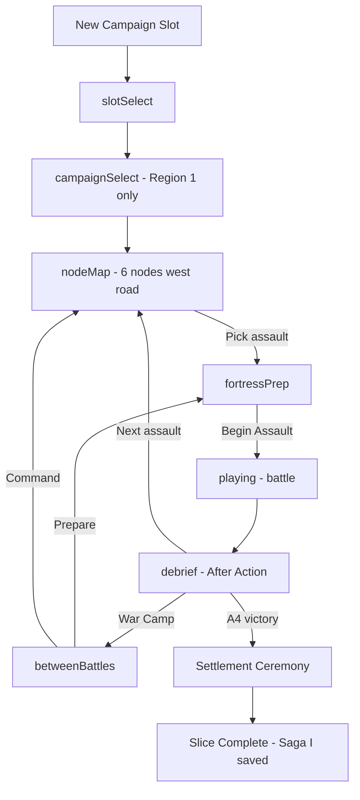

# The First Saga — Vertical Slice

*Design Bible frozen · pre-production complete · implementation north star*

**Status:** Canonical playable target for all engineering until slice ships.  
**Scope:** Age I → Age II threshold only. **No later Ages.**  
**Authority:** [north_star.md](north_star.md) · [moments_to_protect.md](moments_to_protect.md) · [player_journey.md](player_journey.md)

> *"I only had one Berserker… the gate almost fell… we raised stone, we took in a stranger, and the North learned our name."*

---

## 1. Purpose

Deliver one **complete, unforgettable chapter** — not a feature demo. Every mechanic exists to serve a **protected moment**. If it does not serve this saga, it is **out of scope**.

### Slice opens with

| Asset | State |
|-------|--------|
| Heroes | **1** Berserker (unnamed until after first survival) |
| Posts | **West Gate** + **Watch Tower** (scout intel only) |
| Buildings | **Longhouse** (Campfire Hall I), **Tiny Treasury**, **Wooden Palisade** |
| Economy | **Gold** only |
| Map | **Region 1 — Ash Fen** (dedicated slice map; west front only) |

### Slice closes when (all four)

1. **First Stone Wall** segment completed (palisade → stone curtain **ceremony**)
2. **Second named defender** recruited and named
3. **First Boss** defeated (*Ash-Warden* on west front)
4. **Settlement** declared — village becomes hamlet (Age II threshold)

### Explicitly excluded

| Excluded | Why |
|----------|-----|
| Dragons, Drakship | Age V |
| Runes, stars shop, Rune Shrine | Magic layer |
| Fortress spells, rune walls | Citadel |
| Four active fronts | Age II+ command map |
| Food economy, granary upkeep | Age II full — **hint only** at end |
| Siege platforms, ballista | Age III |
| Great Hall stone heart | Age III — Longhouse **upgrades**, not Great Hall |
| Skirmish mode in onboarding | Screen-law violation |
| Captain / Jarl ranks | Post-slice |
| Research, market, diplomacy | Age IV |
| Region 2+ campaign | Post-slice |

---

## 2. Protected moments this slice must land

| # | Moment | Assault / beat |
|---|--------|----------------|
| 1 | First Night — one hero, one gate | A0 |
| 2 | Naming before stats | After A0 |
| 3 | Preparation wins — no battle shop | All battles |
| 4 | Fortress wounded — breach scar | A2 |
| 5 | After Action prose | All debriefs |
| 6 | War Camp — no battlefield | All War Camp |
| 7 | Hero is a person | Naming + debrief |
| 8 | First victory relief | A0 win |
| 9 | Settlement / refugees | Finale |
| 10 | Stone wall ceremony | Finale |
| 13 | Boss punctuation | A4 (boss) |
| 15 | Treasury vault tease | A1 (reserve introduced) |
| 22 | Unlock by fortress evolution | Wood repair, stone from boss |

**Not in slice (OK):** Captain (#12), first fall epitaph (#14), four gates (#10 partial — stone shows **one** upgraded west face + stubs).

---

## 3. Saga structure — six assaults

Linear **west front** chain on Region 1. Command map shows **one road**, six nodes. No front picker.

```
[A0 Tutorial] → [A1] → [A2 Breach teach] → [A3 Repair] → [A4 BOSS] → [Finale Settlement]
```

| ID | Codename | Waves | Purpose | Win required |
|----|----------|-------|---------|--------------|
| **A0** | *First Night* | 1 | Tutorial; fear | Yes |
| **A1** | *Wolf Smoke* | 2 | Relief; gold; treasury | Yes |
| **A2** | *Splinter Raid* | 2 | Gate breach teach | Yes (breach OK) |
| **A3** | *Mended Wood* | 2 | Wood repair; prep depth | Yes |
| **A4** | *Ash-Warden* | 3 | **Boss**; stone reward | Yes |
| **—** | *Settlement Oath* | — | Ceremony; recruit #2 | Auto after A4 |

**Retry:** Any assault retryable from debrief. Field scars persist. No roguelite reset.

---

## 4. Complete player flow



**Session resume:** `sessionSave` restores phase within Region 1 only.

**Never in slice flow:** `mapSelect` (skirmish), rune picker in combat, structure dock in battle, four-front panel.

---

## 5. Screens used (exhaustive)

| Screen | `gamePhase` | Used when | Slice rules |
|--------|-------------|-----------|-------------|
| **Slot select** | `slotSelect` | Boot | One empty slot highlighted |
| **Region select** | `campaignSelect` | After slot | **Only Region 1** unlocked; others grayed "Saga II+" |
| **Command map** | `nodeMap` | Between assaults | West road, 6 nodes; intel on hover |
| **Fortress Prep** | `fortressPrep` | Before each assault | Posts: West Gate, Watch Tower; repair panel A3+ |
| **Battle** | `playing` | Assault | No docks; intel card right; pause/speed OK |
| **After Action** | `debrief` | Assault end | Prose first; 2 buttons max |
| **War Camp** | `betweenBattles` | Optional between assaults | Tabs: **Warband only** + **Fortress** (2 buildings) |
| **Settlement ceremony** | modal on `nodeMap` | After A4 | Full-screen once; then END card |

**War Camp Fortress tab (slice):** Longhouse upgrade, Treasury view, Stone Project progress bar (A3 unlock). **No** recruit in Fortress tab.

**War Camp Recruit tab:** **Locked** until Settlement ceremony completes — then opens for defender #2.

---

## 6. Every battle (detail)

### A0 — First Night (tutorial assault)

| | |
|--|--|
| **Intel** | *"Raiders — 6 bodies, west only. One gate. One hero."* |
| **Enemies** | 6 × raider (low HP); 1 portal west |
| **Waves** | 1 |
| **Posts** | Player must assign Berserker to **West Gate** (only option) |
| **Fail teach** | If lives lost: skald *"The gate is the kingdom."* retry |
| **Battle UI** | Minimal: lives, gold, wave 1/1, gate HP bar |
| **Victory condition** | ≥1 life remaining |
| **Protected** | #1 First Night, #3 prep wins |

### A1 — Wolf Smoke

| | |
|--|--|
| **Intel** | *"Wolves — 10, fast. Two waves. Hold west."* |
| **Enemies** | Wave 1: 6 wolf; Wave 2: 4 wolf + 2 raider |
| **Waves** | 2 (auto-advance wave 2) |
| **New** | Watch Tower post **pulses** — optional assign (same hero; intel +1 line in debrief if "scout" flavor) |
| **Economy** | ~40g battle; **reserve** 15g → Tiny Treasury |
| **Protected** | #8 relief, #15 treasury tease |

### A2 — Splinter Raid

| | |
|--|--|
| **Intel** | *"Raiders carry axes — they aim at the gate."* |
| **Enemies** | 12 total; gate-target weight high |
| **Waves** | 2 |
| **Design intent** | **Gate HP into red** likely; breach possible but not required |
| **Persistence** | Gate damage **saved** to fieldState |
| **Debrief** | If breach: *"The west gate splintered. The wall remembers."* |
| **Protected** | #4 fortress wounded |

### A3 — Mended Wood

| | |
|--|--|
| **Intel** | *"Second raid while we rebuild."* |
| **Unlock** | **Wood** as campaign resource (15 bundled from A2 debrief — "salvage timber") |
| **Prep** | **Repair west gate** — 10 wood (mandatory advisor highlight if scarred) |
| **Enemies** | 14; slightly easier if repaired |
| **Waves** | 2 |
| **Hero** | Berserker → **Veteran** if XP threshold; **one talent** choice in War Camp |
| **Protected** | #22 unlock by repair; stewardship |

### A4 — Ash-Warden (boss)

| | |
|--|--|
| **Intel** | *"Boss — Ash-Warden. Three waves. The west must hold."* |
| **Enemies** | W1: grunts; W2: elites; W3: **Ash-Warden** + escort |
| **Boss read** | Phase telegraph at 50% HP; horn audio |
| **Waves** | 3 |
| **Reward** | **Stone bundle** (30) + boss trophy chronicle |
| **Protected** | #13 boss punctuation |

### Finale — Settlement Oath (non-combat)

| Beat | Content |
|------|---------|
| 1 | Debrief prose: *"Ash-Warden fell. The west road is quiet — for now."* |
| 2 | **Stone Wall ceremony** — west face upgrades palisade → stone; stubs visible on map for "future gates" |
| 3 | Refugee event: *"Families on the road. The Longhouse must grow."* |
| 4 | **Recruit #2** — player picks **Valkyrie** or **Military**; **naming ceremony** |
| 5 | Chronicle chapter: **Saga I — The Settlement** |
| 6 | Slice complete card; Region 2 locked teaser |

---

## 7. Tutorial pacing (one new verb per assault)

| Step | Assault | New verb / concept | Advisor line |
|------|---------|-------------------|--------------|
| 1 | A0 | Assign hero to post | *"Put your fighter on the West Gate."* |
| 2 | A0 | Begin Assault | *"When you're ready — blow the horn."* |
| 3 | Post-A0 | **Name** hero | *"The wall will remember this name."* |
| 4 | A1 | War Camp exists | *"Rest. Count the gold."* |
| 5 | A1 | Treasury reserve | *"Gold in the chest stays between fights."* |
| 6 | A2 | Read intel card | *"They come from the west. Match the gate."* |
| 7 | A2 | Gate HP / breach | *"Gates can break. The fortress can scar."* |
| 8 | A3 | **Repair** with wood | *"Mend the gate before the next horn."* |
| 9 | A3 | Talent (one pick) | *"Veterans learn tricks."* |
| 10 | A4 | Boss intel | *"This one won't rush alone."* |
| 11 | Finale | Recruit + Settlement | *"We are no longer a camp."* |

**Rules:** No tooltip more than 2 lines. No simultaneous wood + stone + food tutorials. Skirmish never mentioned in Saga I.

---

## 8. Hero progression (slice)

| Stage | Trigger | Visible change |
|-------|---------|----------------|
| Unnamed Berserker | Start | Class label only |
| **Named** | After A0 survival | Name on card, battle, debrief |
| XP gain | Per kill + wave | Bar on War Camp card |
| **Veteran** | After A3 (or A2 if MVP) | Rank label; **1 talent** from class pool (3 choices) |
| Defender #2 | Finale | Named recruit; **no rank** yet (Village Guard) |

**Talents (slice pool — 3 shown, pick 1):** e.g. *Hold Fast*, *Blood Fury*, *Steady Feet* — fantasy only, no numbers in doc.

**No:** Captain, Jarl, equipment, runes, traits roll (fixed starter trait silent), injuries.

---

## 9. Fortress progression (slice)

| Stage | Trigger | Visual |
|-------|---------|--------|
| Palisade + timber west gate | Start | Small ring, one gap |
| Watch Tower | Start | Platform icon on schematic |
| Tiny Treasury | After A0 | Chest on schematic |
| Gate **scar** | A2 breach | Cracked palisade art |
| Gate **repaired** | A3 prep | Patch visible |
| **Stone west face** | Finale | Stone texture west; palisade elsewhere |
| Longhouse smoke + | Finale | Settlement backdrop in War Camp |
| Gate stubs (gray) | Finale | N/E/S sealed — "Age II" tease |

**Longhouse (Fortress tab):** Tier I entire slice; upgrade to **Longhouse II** only at finale (cosmetic + recruit cap 2).

---

## 10. Economy progression (slice)

| Resource | Introduced | Earn | Spend |
|----------|------------|------|-------|
| **Gold** (battle) | A0 | Kills, waves | — (no in-battle shop) |
| **Gold reserve** | A1 | 25% of earned → treasury | Recruit #2 cost (finale) |
| **Wood** | A3 prep | A2 debrief bundle (15) | Gate repair (10) |
| **Stone** | A4 victory | Boss drop (30) | Stone wall project (30) — auto-spend at ceremony |

**No:** Stars, iron, food, reputation, knowledge.

**Plunder:** 1–2 enemies leak on A2 teaches gold loss line in debrief — optional not required.

---

## 11. Rewards table

| Assault | Gold (battle) | Reserve | Other | Chronicle |
|---------|---------------|---------|-------|-----------|
| A0 | 20 | +5 | Naming unlock | Entry 1 |
| A1 | 35 | +10 | — | Entry 2 |
| A2 | 30 | +8 | Gate scar | Entry 3 |
| A3 | 40 | +10 | Wood 15, Veteran | Entry 4 |
| A4 | 50 | +15 | Stone 30, boss trophy | Entry 5 |
| Finale | — | — | Recruit #2, Settlement | **Chapter I** |

---

## 12. Unlock pacing

| Unlock | Gate (fiction) | Never |
|--------|----------------|-------|
| Naming | Survive A0 | Level |
| War Camp | A0 debrief | Before first win |
| Treasury reserve | A1 | — |
| Intel card detail | A1 | — |
| Wood + repair | A3 (requires scar or advisor) | Before A2 |
| Veteran + talent | A3 War Camp | Before A2 |
| Boss node | A3 cleared | Before repair teach |
| Stone + ceremony | A4 kill | Before boss |
| Recruit #2 | Settlement ceremony | Before finale |
| Region 2 | Post-slice | During Saga I |

---

## 13. Emotional pacing

```
A0  FEAR ──► RELIEF (name)
A1  COMPETENCE ──► PRIDE (gold)
A2  SHOCK (breach) ──► STEWARDSHIP (scar)
A3  AGENCY (repair) ──► GROWTH (veteran)
A4  TENSION ──► TRIUMPH (boss)
Finale BELONGING (settlement) ──► HOPE (recruit #2)
```

**Session length target:** 45–75 minutes first play; 30 min replay.

**Music acts:** A0 sparse → A1 light motif → A2 breach drone → A3 hammer repair → A4 boss theme → Finale hearth chorus.

---

## 14. Chronicle entries (complete list)

| # | Trigger | Title | Prose (target) |
|---|---------|-------|----------------|
| 1 | A0 win | *First Night* | "{Name} held the west gate alone. The fire still burns." |
| 2 | A1 win | *Wolf Smoke* | "Wolves tested the palisade. {Name} did not yield." |
| 3 | A2 win | *Splinter* | "The gate cracked. We learned the wall can bleed." |
| 4 | A3 win | *Mended Wood* | "{Name} is Veteran. The gate bears a patch like a scar." |
| 5 | A4 win | *Ash-Warden* | "The Ash-Warden fell. Stone was ours by right of victory." |
| 6 | Finale | **Saga I — The Settlement** | "Refugees came. {Name} and {Name2} stand watch. The west face is stone." |

**Hall UI:** Scroll in War Camp — max 6 entries in slice. No export yet.

---

## 15. UI transitions

| From | To | Transition | Duration |
|------|-----|------------|----------|
| slotSelect | campaignSelect | Fade | 0.4s |
| campaignSelect | nodeMap | Pan north | 0.6s |
| nodeMap | fortressPrep | Slide left (map shrinks) | 0.5s |
| fortressPrep | playing | Horn sting + cut | 0.3s |
| playing | debrief | Desaturate + fade | 0.8s |
| debrief | War Camp | Warm fade up | 0.5s |
| debrief | nodeMap | Cold fade | 0.4s |
| War Camp | fortressPrep | Same as map→prep | 0.5s |
| A4 debrief | Settlement ceremony | White flash → illustration | 1.2s |

**Meta bar subtitle:** Updates per phase — never more than one coaching line.

**Debrief buttons (slice):** `WAR CAMP` · `NEXT ASSAULT` (or `SEE CEREMONY` after A4).

---

## 16. UI content limits (anti-bloat)

| Screen | Max interactive elements |
|--------|-------------------------|
| fortressPrep | 2 posts, 1 repair button, 1 launch |
| War Camp | 2 tabs, 2 building cards, 1 hero card |
| debrief | 1 prose block, 2 buttons |
| nodeMap | 6 nodes, 1 CTA |

---

## 17. Implementation alignment (prototype)

| Slice need | Prototype today | Gap |
|------------|-----------------|-----|
| fortressPrep + posts | ✅ | Phase 1–2 shipped |
| War Camp no field | ✅ | Phase 3 — meta only |
| Prose debrief | ✅ | Phase 5 — `debriefReport.js` |
| Gate scar persist | ✅ | A2 debrief → west gate scar |
| Wood repair | 🟡 | Salvage in debrief/prep; spend UI thin |
| Linear 6-node map | ❌ | Region 1 script |
| Settlement ceremony | ❌ | New modal |
| Boss A4 | ✅ | Retune for slice |
| Recruit gate | ✅ | Lock until finale (ceremony missing) |

*Last board review: 2026-06-22 Session 18 — see `agents/boards/sessions/2026-06-22-all-agents-board-18.md`.*

---

## 18. Creative Director review — CUT list

*Removed from slice scope after review. Do not implement until Saga II.*

### Systems CUT

- Stars, runes, rune shop, shrine
- All siege structures
- Four-front command map UI
- Skirmish entry point in campaign flow
- Food / granary / upkeep
- Fortress roles UI (gatekeeper bonus **runs silently** if code exists)
- Composition meter / squad presets
- Traits display (traits may exist in data; no UI)
- Equipment, armory
- Events system beyond finale refugee
- Session features unrelated to Region 1

### Screens CUT

- `mapSelect`
- Combat warband/structures tabs
- Rune picker
- Front panel view
- Region 2–100

### Progression CUT

- Captain, Jarl, High King
- Great Hall (use Longhouse only)
- Quarry, mine, market
- Second region unlock (tease only)

### Content CUT

- 8 hero posts → **2 active**
- 6 hero classes → **2** at end (+ starter)
- Multi-portal assaults
- Wave events (frost, swarm)
- Achievements popups

### Why CUT is correct

Saga I memory is: **one name, one gate, one scar, one boss, one stone face, two names at the fire.**  
Anything else dilutes the quote *"I only had one Berserker."*

---

## 19. Slice success criteria

| Test | Pass |
|------|------|
| New player names hero without prompt confusion | |
| Player quotes gate breach unprompted | |
| Player describes repair as "healing the fortress" | |
| Boss feels distinct from A1 | |
| Finale recruit feels like **belonging**, not shop | |
| No player asks "where do I build towers" | |
| Playtime 45–75 min | |

---

## 20. After slice ships

Saga II begins: **north front** unlock, food hint, third recruit, sealed gates 2/4. Design Bible remains frozen; new work **extends** Ages, does not rewrite Tier 1 moments.

---

## See also

- [moments_to_protect.md](moments_to_protect.md)
- [progression_tree.md](progression_tree.md) — Ages I–II
- [DEFENSIVE_POSTS.md](DEFENSIVE_POSTS.md) — implement 2 posts only in slice
- [IMPLEMENTATION_ROADMAP.md](IMPLEMENTATION_ROADMAP.md) — superseded for slice by **this document**
